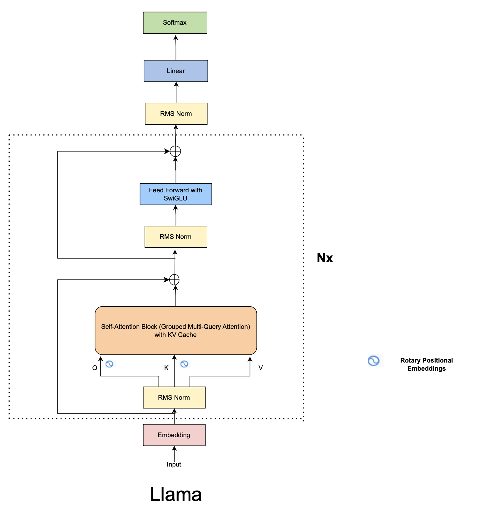

# Blocks-in-Llama
Exploring all the blocks (legos) to build the Llama model. Both coding + conceptual understanding. Part of a course taken during IIITH days.

## Topics documented
- Architectural Difference between Vanilla Transformers and Llama
- RMS Norm (review LayerNorm from papers)
- Rotary Positional Embeddings
- KV-Cache
- Multi-Query Attention
- Grouped Multi-Query Attention
- SwiGLU Activation Function

### Architecture
- 

### Steps to download the model checkpoint
- [Place Request to download the model](https://www.llama.com/llama-downloads/)
- Install the Llama-CLI
    ```bash
    pip install llama-toolchain
    ```
- Choose the model to install
    ```bash
    llama download --source meta --model-id CHOSEN_MODEL_ID
    ```
    - For Example (we get these `model-id` in the mail under <kbd>Model weights available</kbd>): 
        - `Llama-2-7b` is model-id for 7 billion params model
        - `Llama-2-13b` is model-id for 13 billion params model
- When prompted with the signed URL, use the one received on the mail.
